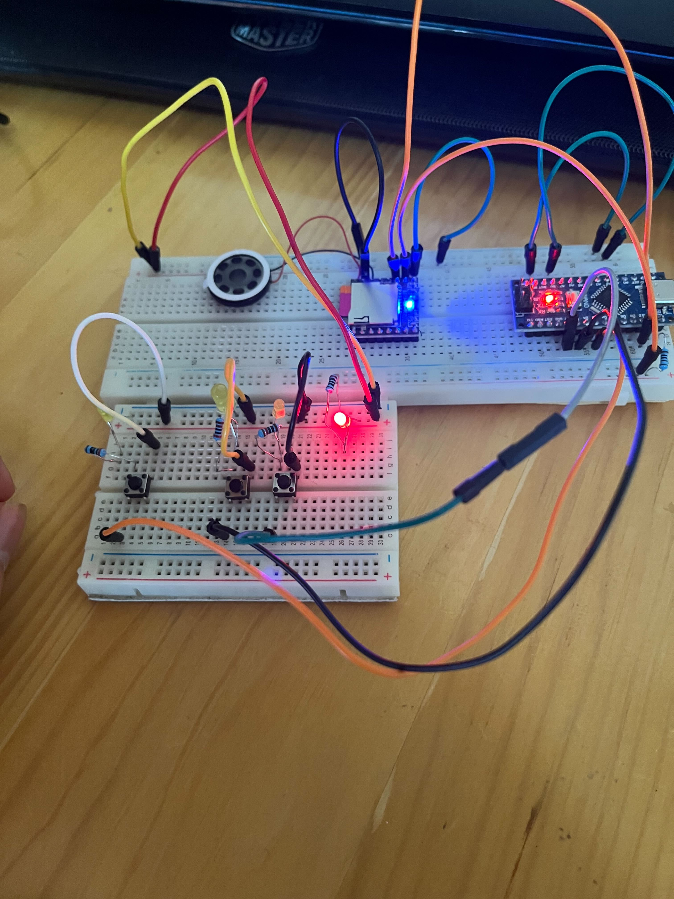
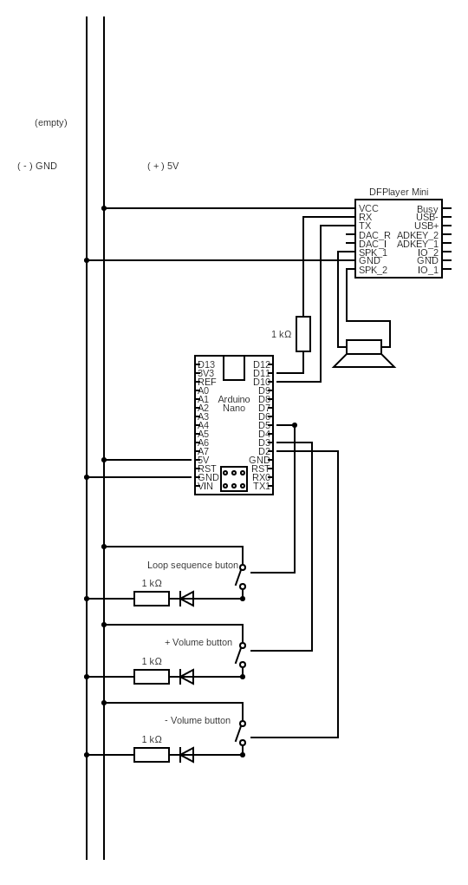

# Arduino Bird Chaser Software

This software helps you deter birds from frequenting balconies and terraces in buildings, where they can disturb residents. It uses an Arduino Nano, an SD card with MP3 bird sounds, and a speaker to play these sounds at intervals. You can control the playback interval and volume using buttons.

## Features

- Adjustable loop speed (10s, 30s, 5min, 10min, 30min)
- Volume control (+/-)

## Hardware Requirements

- Arduino Nano
- Mp3-TF-16p MP3 module
- 1K Ohm resistor (for pin D11)
- 2 x 220 Ohm resistors for diodes
- 2W mobile speaker
- 16GB/32GB SD card
- Button for changing the loop rhythm
- Wires and jumper cables

## Setup

1. **Wiring:** Connect the components as shown in the images below:

   

   - [Image of final setup](./img/IMG_1314.jpg)
   - [Image of initial setup](./img/IMG_1301.jpg)

2. **SD Card Preparation:**
   - Format the SD card with the FAT32 file system.
   - Copy the desired bird sound MP3 files to the SD card's root directory.

3. **Arduino Code:**
   - Upload the provided Arduino code to your Arduino Nano.

      
## Usage

1. Power on the device.
2. Use the button to cycle through the different loop speeds.
3. Adjust the volume using the +/- buttons.

## Notes

- Ensure the speaker is loud enough to cover the desired area.
- Consider using different bird sounds to prevent habituation.
- This device is intended to deter birds humanely. 

