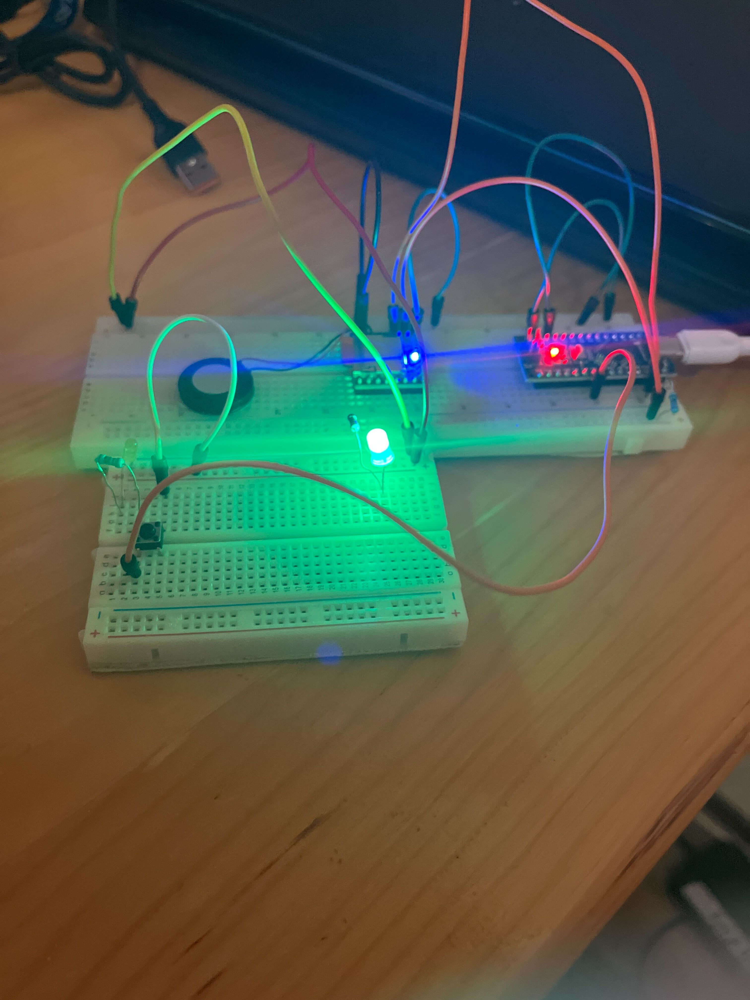
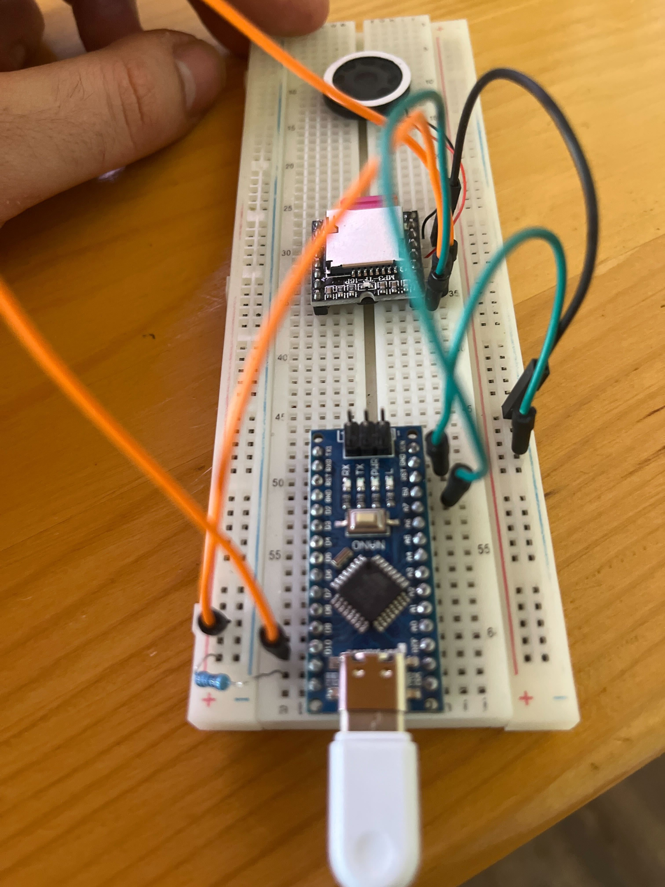

# Arduino Bird Chaser software

## Setup on Arduino Nano

Circuit elements:

- Arduino Nano
- Mp3-TF-16p
- 1K Om resistor (for pink D11)
- 2 x 220 Om resistor for diods
- 2w mobile speaker
- SD card 16gb
- button for chaningn the loop rythm
- wiers and jumper cables

